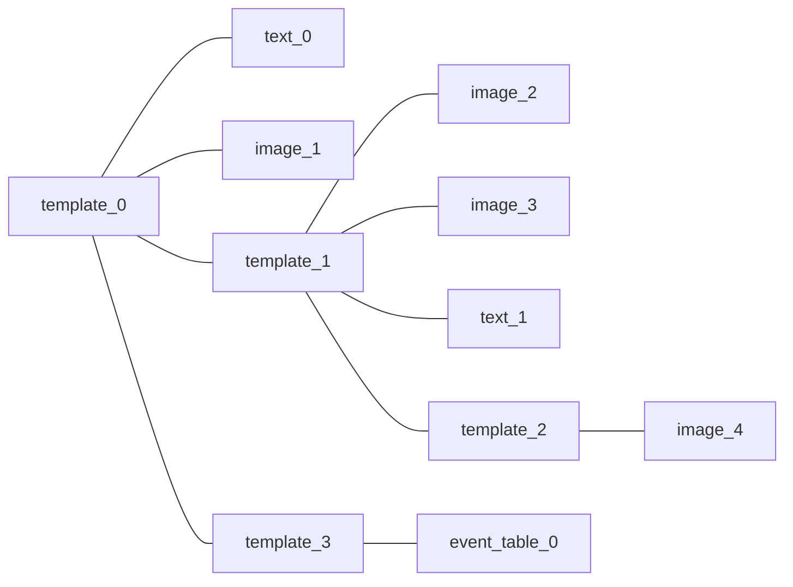

# TWIG

A **TWIG** (abbreviation of *This Week In Griffin*) is a graphic collection and summarization of Griffin Hall's weekly events, which consists of two parts:

- TWIG Template
- Event Graphics

## TWIG Template

As the name implies, the **TWIG Template** is a template of each TWIG. A template can be applied to the events in a single week, or multiple weeks. It can be also applied to one or more portfolios.

### Database storage structure

The details of each TWIG template are stored in the **twig_template** table in the main eTWIG database, including the following fields:

- **id**: The identification number of each template, which is the primary key of this table. [integer, not null]
- **name**: The name of this template [varchar 63, not null].
- **available_from**: The template is invalid before this date. Null means there are no restrictions on this date. [date, null allowed]
- **available_to**: The template is invalid after this date. Null means there are no restrictions on this date. [date, null allowed]
- **creator_role**: The person/role who created this template. It is the foreign key of the id field in the **user_role** table. [integer, not null]
- **portfolio**: The portfolio scope of this template. [integer, null allowed] It can be:
  - **A portfolio id**, which specifies a designated portfolio. In this case, it can be treated as the foreign key of the id field in the portfolio table.
  - **Null**, which stands for all portfolios.
- **design**: The design of the template in PostgreSQL JSONB format.

### Design JSON structure

Each template is a **non-binary tree**, and each node contains zero or more children, which can be expressed in an array of other node objects. There is also a **data** part on each node.

If a node has no children nodes, it is a **leaf node**, which can carry the following types of widgets:

- **An image** that is stored on the server filesystem, which is corresponding to the assets subsystem. (Leaf Node)
- A **styled text** that has adjustable attributes (e.g., size, color and weight). (Leaf Node)
- **An event table** that contains multiple event graphics.

Otherwise, the node is an **internal node**, it can only carry the following type of widget:

- **A sub-template** that is a smaller version of the TWIG template.



#### Node

Each node contains two fields: **children** and **widget**. Children is a **list** of the Node objects of other nodes, while the widget is an object of Widget classes (one of Image, Text, Table and Template). Here is a sample definition in JavaScript.

``` js
class Node {

  constructor() {
    this.children = [node1, node2];   // Array of other node
    this.widget = image1;             // Object of a data widget
  }
}
```

The **layer** of the widgets is based on the height of the tree, the node of top-layer widgets always has a higher height than the node of bottom-layer widgets. The **position** of the widgets depends on not the whole canvas, but the parent template. (i.e., relative position)

#### Template

**The Template object** is a group of widgets with a rectangle area. **The widget of the root node should be a template.** It has the following properties:

- **posX**: The X coordinate of the starting point of a template.
- **posY**: The Y coordinate of the starting point of a template.
- **width**: The width of the template area.
- **height**: The height of the template area.

#### Image

**The Image object** is a reference of an asset in the **asset** table in the database. It is usually a **transparent** PNG image (unless the background is not transparent). The Image object contains the following properties:

- **assetId**: The identification number of the asset.
- **posX**: The X coordinate of the starting point of a template.
- **posY**: The Y coordinate of the starting point of a template.
- **width**: The width of the image. Please note that the height of the image depends on the aspect ratio of the original image. (i.e., auto-inferred).

#### Text

**The Text object** is a normal text that displays on the screen, which contains the following properties:

- **posX**: The X coordinate of the text.
- **posY**: The Y coordinate of the text.
- **content**: The content of the text.
- **color**: The color of the text in hexadecimal form. (e.g., #FF0000 means red).
- **size**: The font size.

#### Event Table

**The event table object** is the collection of **daily events**, so one week should have 7 such objects. They are the core content of each TWIG, and also another kind of calendar.

The event table is another kind of "template" but it can only include the event graphics and not other widgets. The Event Table object contains the following properties:

- **posX**: The X coordinate of the starting point of the table.
- **posY**: The Y coordinate of the starting point of the table.
- **width**: The width of the table.
- **height**: The height of the table.
- **isWeekend**: True means the date is a weekend, otherwise means the date is a weekday.

The event graphics will be properly placed in this table by portfolio, and event time.

## Event Graphics

**Event Graphics** are also images. They are managed internally in the **event tables object**  and will be fetched based on some conditions (e.g., week and portfolio)

### TWIG Arrangement Algorithm (TAA)

#### Algorithm input

- A **map** of all events on a certain day.
- The object of the **event table widget**.
- The **range** of acceptable sizes.

#### Algorithm output

A list of the positions of all event graphics.

#### Internal data structure

**The event time slot** object. This object stores the information of an event graphic and the layout of it. Each time slot corresponds to such an object, which contains:

- **EventId:** The identification number of the event.
- **posX:** The relatively X coordinate of the graphic.
- **posY:** The relatively Y coordinate of the graphic.
- **assetId:** The graphic asset of this event.

#### Steps: Main algorithm

- **Step 1:** Determine the length of the time slot map, which is **N+3**.
  - **Base length N** will be determined by the event date (case 1).
    - **Weekday** events, N=13 (9:00 - 21:00), hence the length of the map is 16.
    - **Weekend** events, N=3 (morning 9:00-12:00, afternoon 13:00-18:00, evening 19:00-21:00), hence the length of the map is 5.
  - **Additional length 3** are:
    - **All-day events** (case 2)
    - The events **before** the display starting time (case 3)
    - The events **after** the display ending time (case 4)

- **Step 2:** Assign the **key element** of this map, which has the following 4 cases:
  - **Case 1:** the hour part of the time (in a 24-hour clock)
  - **Case 2:** NaN
  - **Case 3:** Negative infinity
  - **Case 4:** Positive infinity
- **Step 3:** Allocate the events and do the following things until the event list (a.k.a, buffer) is empty.
  - Try to **put an event** into the corresponding time slot.
    - If the time slot is free, put this event into the slot directly, and remove the event from the buffer.
    - Otherwise, find the **nearest free slot**. Treat all events whose time is between the free slot and the time of the current event as an **event block**. Move the event block entirely.
  - If the time slot map is full, terminate the loop early and discard all remaining events.
- **Step 4:** Return the time slot map.

#### Examples

**Example 1:** Normal condition.

- **Day of Week:** Friday.
- **Event list:** (Only contains the event ID and time in there)
  - 1, All day
  - 2, 8:00
  - 3, 9:00
  - 4, 11:00
  - 5, 14:30
  - 6, 18:00
  - 7, 21:30

Here is the **allocation outcome**:
| **Key**  | Event  | **Key**  | Event  | **Key** | Event  |
|----------|--------|----------|--------|---------|--------|
| **-1**   | 1      | **-INF** | 2      | **9**   | 3      |
| **10**   | (null) | **11**   | 4      | **12**  | (null) |
| **13**   | (null) | **14**   | 5      | **15**  | (null) |
| **16**   | (null) | **17**   | (null) | **18**  | 6      |
| **19**   | (null) | **20**   | (null) | **21**  | 7      |
| **+INF** | (null) |          |        |         |        |

**Example 2:** With time slot movement.

- **Day of Week:** Friday.
- **Event list:** (Only contains the event ID and time in there)
  - 1, 9:00
  - 2, 9:00
  - 3, 11:00
  - 4, 11:30
  - 5, 12:00
  - 6, 12:30

Here is the **allocation outcome**:

(First allocation: buffer remaining values: 2, 4, 6)
| **Key**  | Event  | **Key**  | Event  | **Key** | Event  |
|----------|--------|----------|--------|---------|--------|
| **-1**   | (null) | **-INF** | (null) | **9**   | 1      |
| **10**   | (null) | **11**   | 3      | **12**  | 5      |
| **13**   | (null) | **14**   | (null) | **15**  | (null) |
| **16**   | (null) | **17**   | (null) | **18**  | (null) |
| **19**   | (null) | **20**   | (null) | **21**  | (null) |
| **+INF** | (null) |          |        |         |        |

For event 2 (9:00), the nearest free slot is -INF. Move event 1 to -INF slot, and place event 2 in the 9 slot.

| **Key**  | Event  | **Key**  | Event  | **Key** | Event  |
|----------|--------|----------|--------|---------|--------|
| **-1**   | (null) | **-INF** | 1      | **9**   | 2      |
| **10**   | (null) | **11**   | 3      | **12**  | 5      |
| **13**   | (null) | **14**   | (null) | **15**  | (null) |
| **16**   | (null) | **17**   | (null) | **18**  | (null) |
| **19**   | (null) | **20**   | (null) | **21**  | (null) |
| **+INF** | (null) |          |        |         |        |

For event 4 (11:30), the nearest free slot is 10. Move the event 3 to 10 slot, and place the event 4 in the 11 slot.

| **Key**  | Event  | **Key**  | Event  | **Key** | Event  |
|----------|--------|----------|--------|---------|--------|
| **-1**   | (null) | **-INF** | 1      | **9**   | 2      |
| **10**   | 3      | **11**   | 4      | **12**  | 5      |
| **13**   | (null) | **14**   | (null) | **15**  | (null) |
| **16**   | (null) | **17**   | (null) | **18**  | (null) |
| **19**   | (null) | **20**   | (null) | **21**  | (null) |
| **+INF** | (null) |          |        |         |        |

For event 6 (12:30), the nearest free slot is 13. Place it in the 13 slot.
