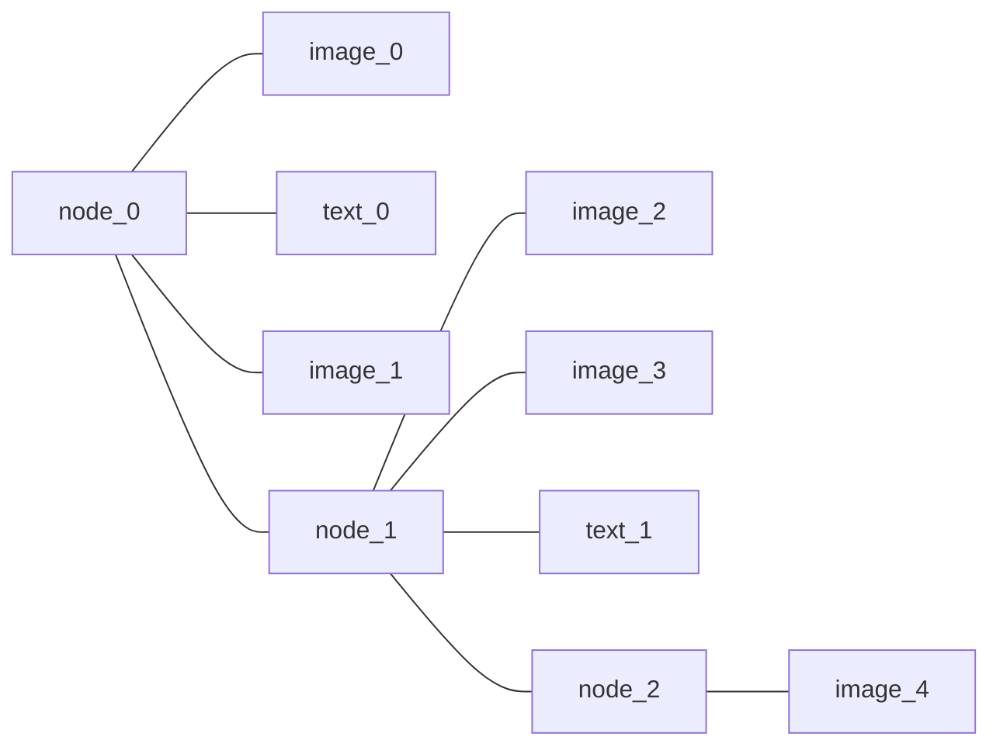

# TWIG

A **TWIG** (abbreviation of *This Week In Griffin*) is a graphic collection and summarization of Griffin Hall's weekly events, which consists of two parts:

- TWIG Template
- Event Graphics

## TWIG Template

As the name implies, **TWIG Template** is a template of each TWIG. A template can be applied on the events in a single week, or multiple weeks, it can be also applied on one or more portfolios.

### Database storage structure

The details of each TWIG template is stored in the **twig_template** table in the main eTWIG database, including the following fields:

- **id**: The identification number of each template, which is the primary key of this table. [integer, not null]
- **name**: The name of this template [varchar 63, not null].
- **available_from**: The template is invalid before this date. Null means there no restrictions on this date. [date, null allowed]
- **available_to**: The template is invalid after this date. Null means there no restrictions on this date. [date, null allowed]
- **creator_role**: The person/role who created this template. It is the foreign key of the id field in **user_role** table. [integer, not null]
- **portfolio**: The portfolio scope of this template. [integer, not null] It can be:
  - **A portfolio id**, which specifies a designated portfolio. In this case, it can be treated as the foreign key of the id field in the portfolio table.
  - **A negative number**, which stands for all portfolios.
- **design**: The design of the template in PostgreSQL jsonb format.

### Design JSON structure

Each template is a **non-binary tree**, and each node contains zero or or more children, which is expressed in an array of other node objects. There are also **data** part on each node, here is a sample definition in JavaScript.

``` js
class Node {

  constructor() {
    this.children = [node1, node2]; // Array of other node
    this.data = image1;             // Object of a data widget
  }
}
```

If a node has **no children nodes**, it is a **leaf node**, which can carry the following 


Each node can be:

- **An image** that is stored on the server filesystem, which corresponding to the assets subsystem. (Leaf Node)
- **A styled text** which has the adjustable attributes (e.g., size, color and weight). (Leaf Node)
- **Another node**.




/**
 *  
 *  three kinds of widgets:
 
 * 
 * So the elements on each TWIG 
 * ---------------------------------------------
 * |   
 * |    LO      Title              Week    
 * |    GO
 * |
 * |
 * |
 * |
 * |
 * |
 * |
 * |
 * -------------------------------------------- 
*/
