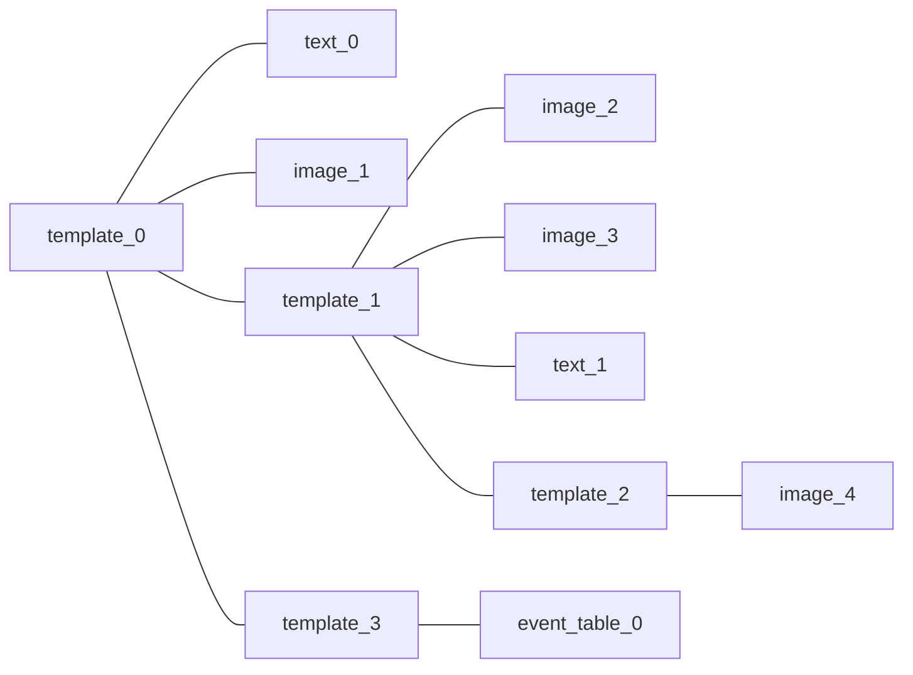

# TWIG

A **TWIG** (abbreviation of *This Week In Griffin*) is a graphic collection and summarization of Griffin Hall's weekly events, which consists of two parts:

- TWIG Template
- Event Graphics

## TWIG Template

As the name implies, **TWIG Template** is a template of each TWIG. A template can be applied on the events in a single week, or multiple weeks, it can be also applied on one or more portfolios.

### Database storage structure

The details of each TWIG template is stored in the **twig_template** table in the main eTWIG database, including the following fields:

- **id**: The identification number of each template, which is the primary key of this table. [integer, not null]
- **name**: The name of this template [varchar 63, not null].
- **available_from**: The template is invalid before this date. Null means there no restrictions on this date. [date, null allowed]
- **available_to**: The template is invalid after this date. Null means there no restrictions on this date. [date, null allowed]
- **creator_role**: The person/role who created this template. It is the foreign key of the id field in **user_role** table. [integer, not null]
- **portfolio**: The portfolio scope of this template. [integer, not null] It can be:
  - **A portfolio id**, which specifies a designated portfolio. In this case, it can be treated as the foreign key of the id field in the portfolio table.
  - **A negative number**, which stands for all portfolios.
- **design**: The design of the template in PostgreSQL jsonb format.

### Design JSON structure

Each template is a **non-binary tree**, and each node contains zero or or more children, which can be expressed in an array of other node objects. There are also **data** part on each node.

If a node has no children nodes, it is a **leaf node**, which can carry the following type of widgets:

- **An image** that is stored on the server filesystem, which is corresponding to the assets subsystem. (Leaf Node)
- **A styled text** which has the adjustable attributes (e.g., size, color and weight). (Leaf Node)
- **A event table** that contains multiple event graphics.

Otherwise, the node is an **internal node**, it can only carry the following type of widget:

- **A sub-template** that is a smaller version of TWIG template.



#### Node

Each node contains two fields: **children** and **data**. Children is a **list** of the Node objects of other nodes, while data is a object of Data classes (one of Image, Text, Table and Template). Here is a sample definition in JavaScript.

``` js
class Node {

  constructor() {
    this.children = [node1, node2]; // Array of other node
    //this.id = uuid;                 // A uuid that specifies this node.
    this.data = image1;             // Object of a data widget
  }
}
```

The **layer** of the widgets are based on the height of the tree, the node of top-layer widgets always have a higher height than the node of bottom-layer widgets. The **position** of the widgets are depends on not the whole canvas, but the parent template. (i.e., relative position)

#### Template

**The Template object** is a group of widgets with a rectangle area, it has the following properties:

- **posX**: The X coordinate of the starting point of a template.
- **posY**: The Y coordinate of the starting point of a template.
- **width**: The width of the template area.
- **height**: The height of the template area.

#### Image

**The Image object** is a reference of an asset in the **asset** table in the database. It is usually a **transparent** PNG image (unless the background, which is not transparent). The Image object contains the following properties:

- **assetId**: The identification number of the asset.
- **posX**: The X coordinate of the starting point of a template.
- **posY**: The Y coordinate of the starting point of a template.
- **width**: The width of the image. Please note that the height of the image is depends on the aspect ratio of the original image. (i.e., auto-inferred).

#### Text

**The Text object** contains the following properties:

- **content**: The content of the text.
- **color**: The color of the text in hexadecimal form. (e.g., #FF0000 means red).
- **size**: The font size.

#### Event Table

**The event tables object** is the collection of events. They are the core content of each TWIG, and also another kind of calendar.

Each event table actually is another "template" but it can only includes the event graphics and not other widgets. The Event Table object contains the following properties:

- **posX**: The X coordinate of the starting point of the table.
- **posY**: The Y coordinate of the starting point of the table.
- **width**: The width of the table.
- **height**: The height of the the table.
- **dayStart**: The starting time of a day (e.g., 8 AM).
- **dayEnd**: The ending time of a day.

## Event Graphics

**Event Graphics** are also images. They are managed internally in the **event tables object**  and will be fetched based on some conditions (e.g., week and portfolio)